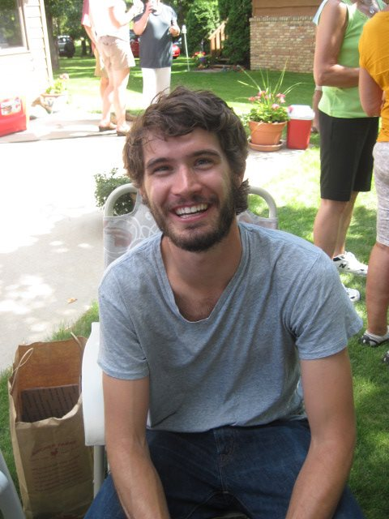

Ryan M. Bergmann, PhD Candidate
===================================

Education
---------

* M.S. Nuclear Engineering: Massachusetts Institute of Technology, Cambridge, MA, 2009
* B.S. Nuclear Engineering: Massachusetts Institute of Technology, Cambridge, MA, 2008

Publications
------------
* `R. M. Bergmann, J. L. Vujic, N. A. Fischer, "2D Mono-Energetic Particle Transport on a GPU,"  ANS Winter Meeting Transactions, November 2012.`
* `T. Downar, A. Hall, D. Jabaay, A. Ward, E. Greenspan, F. Ganda, F. Bartoloni, R. Bergmann, C. Varela, C. DiSanzo, M. Kazimi, A. Karahan, E. Shwageraus, B. Feng, B. Herman, "Technical Evaluation of the Hitachi Resource-Renewable BWR (RBWR) Design Concept," EPRI Technical Report 1025086, April 2012.`
* `J. Vujic, R. M. Bergmann, R. Skoda, M. Miletic, "Small modular reactors: Simpler, safer, cheaper?" Energy (2012), doi:10.1016/j.energy.2012.01.078`
* `A. C. Boxer, R. Bergmann, J. L. Ellsworth, D. T. Garnier, J. Kesner, M. E. Mauel & P. Woskov, "Turbulent inward pinch of plasma confined by a levitated dipole magnet," Nature Physics, 24 January 2010, doi:10.1038/nphys1510`
* `Master's Thesis`__

.. __: http://dspace.mit.edu/handle/1721.1/53240

Abstracts / Presentations
-------------------------

* `R. M. Bergmann, J. L. Vujic, N. A. Fischer, "2D Mono-Energetic Particle Transport on a GPU,"  ANS Winter Meeting Poster Competition, 2012 November 11-15, San Diego, California.`
* `Vladimir Mozin, Jasmina Vujic, Bernhard Ludewigt, Ryan M. Bergmann, "Feasibility of the Delayed Gamma-Ray Spectroscopy for Nuclear Materials Assay," Symposium on Radiation Measurements and Applications (SORMA), 2012 May 14-16, Oakland, California.`
* `Ryan M. Bergmann, Lazar Supic, Vladimir Mozin, Bernhard Ludewigt, Jasmina Vujic, "Delayed Gamma-Ray Spectroscopy for Non-Destructive Assay of Nuclear Materials," University and Industry Technical Interchange (UITI), 2011 Dec 6-8, Oakland, California.`
* `Ryan Bergmann, Tommy Cisneros, Christian Di Sanzo, Brian Frisbie, Ehud Greenspan, “A Search for Optimal Blanket Design for the LIFE Fusion-Fission Reactor,” The Third International Symposium on Innovative Nuclear Energy Systems (INES), 2010 Oct 31 – Nov 3, Tokyo, Japan, pg. 23, P-105.`
* `R. M. Bergmann, A. C. Boxer, et al., “Observation of low-frequency oscillations in LDX with an angular electrostatic probe,” American Physical Society Division of Plasma Physics Conference, 2008 Nov 17-21, Dallas, Texas, pg.73 CP6-87`

Awards
------
* `Virgil Schrock Memorial Fellowship for Excellence in Teaching`
